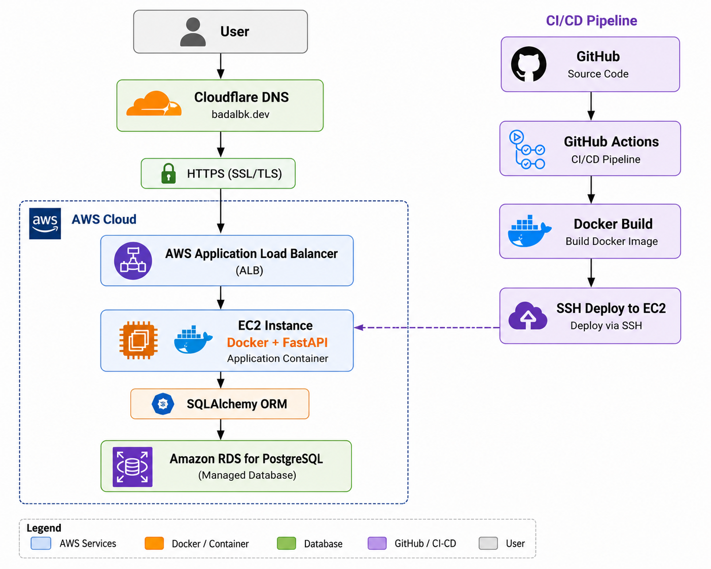

# ☁️ CloudForge

Production-ready AWS DevOps Automation Platform built with FastAPI, Docker, PostgreSQL, GitHub Actions CI/CD and AWS.

---

## 🚀 Live Demo

**Website**

https://badalbk.dev

**Swagger API**

https://badalbk.dev/docs

---
## 🏗️ Architecture

<p align="center">
  
</p>

## Features

* JWT Authentication
* User Registration & Login
* Project Management API
* Deployment Management API
* PostgreSQL Database
* Dockerized Application
* GitHub Actions CI/CD
* AWS EC2 Deployment
* Application Load Balancer
* HTTPS with ACM
* Cloudflare DNS & SSL

---

## Architecture

```text
Client
   │
Cloudflare
   │
HTTPS
   │
Application Load Balancer
   │
EC2 (Docker)
   │
FastAPI
   │
Amazon RDS PostgreSQL
```

---

## Technology Stack

| Category       | Technology     |
| -------------- | -------------- |
| Backend        | FastAPI        |
| Database       | PostgreSQL     |
| ORM            | SQLAlchemy     |
| Authentication | JWT            |
| Cloud          | AWS            |
| Compute        | EC2            |
| Load Balancer  | ALB            |
| DNS            | Cloudflare     |
| Container      | Docker         |
| CI/CD          | GitHub Actions |

---

## API

### Authentication

* POST /auth/register
* POST /auth/login
* GET /auth/me

### Projects

* GET /projects
* POST /projects
* GET /projects/{id}
* DELETE /projects/{id}

### Deployments

* GET /deployments
* POST /deployments
* GET /deployments/{id}
* DELETE /deployments/{id}

---

## Status

✅ Production Ready

---

## Author

**Badal BK**

